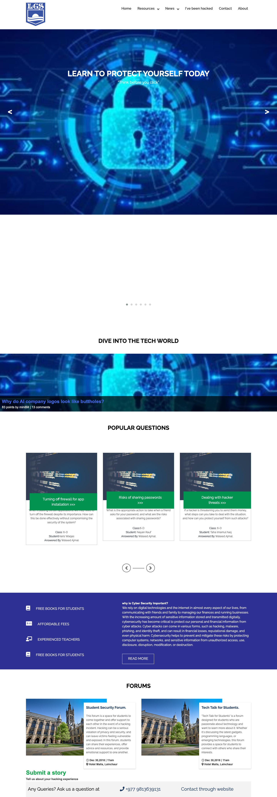
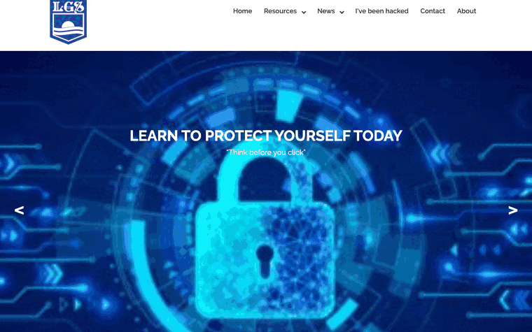
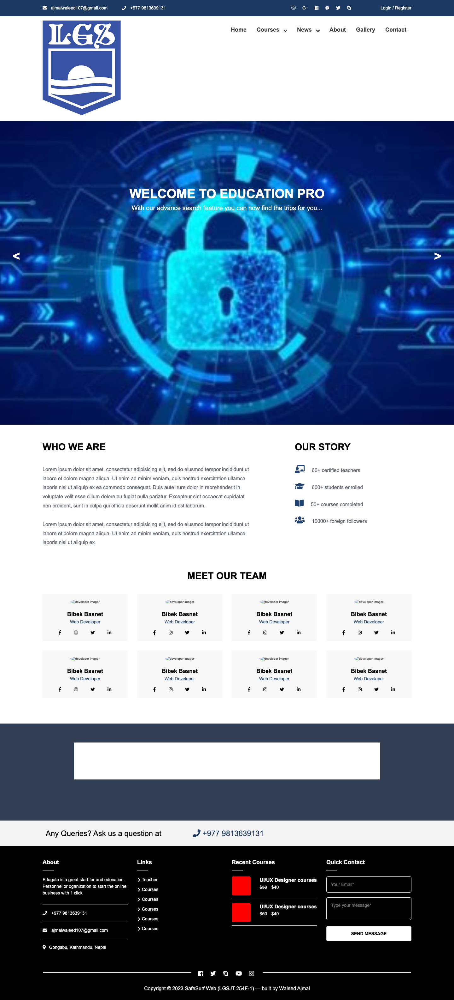
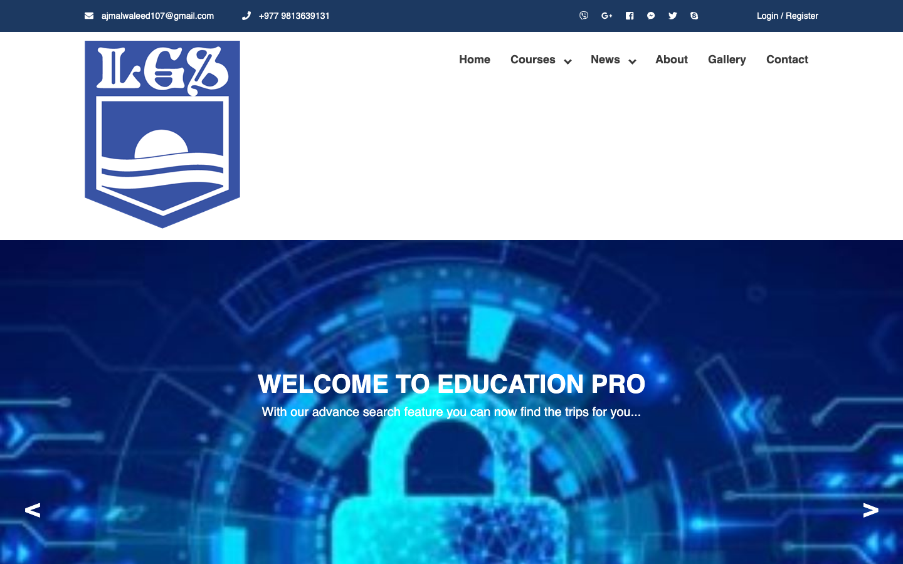
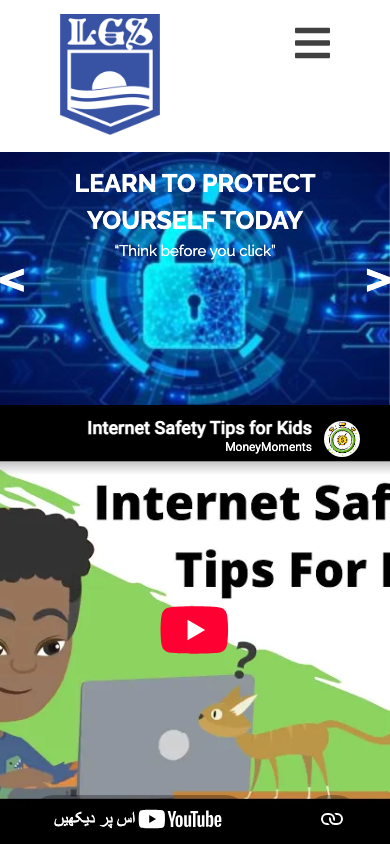

# 🔐 SafeSurf Web — *LGSJT 254F-1*

> **Think before you click.** A friendly, no-jargon cybersecurity awareness website that helps everyday people (and especially students) stay safe online — from phishing and password hygiene to "what do I do if I've *actually* been hacked?"

Built by **Waleed Ajmal** as a school tech project, SafeSurf is a small multi-page static site with a big mission: make staying safe on the internet feel approachable instead of scary. No fear-mongering, no walls of tech-speak — just clear advice, a student Q&A forum, and a few resources to help you surf without wiping out. 🏄



### 🎬 Take a scroll through it



*A quick pan down the landing page: the hero, the student Q&A cards, the "why cyber security matters" panel, and the forums — all in one scroll.*

---

## ✨ What's inside

- **Learn to protect yourself** — a hero-led landing page with the golden rule front and center: *think before you click*.
- **Popular Questions** — real questions from students (turning off your firewall, sharing passwords, dealing with threats) answered in plain English.
- **Student Security Forums** — a space to swap stories and support each other after a hacking scare.
- **"I've been hacked" help** — a calm, step-by-step corner for when things go wrong.
- **Resources & News** — curated links to keep learning, plus a downloadable security primer (PDF).
- **Contact** — a simple form to reach out (drop us a line, no strings attached).

## 📸 A peek around the site

| About | Courses / Resources | On your phone |
|:-----:|:-------------------:|:-------------:|
|  |  |  |

Fully responsive — it folds down neatly to a tidy hamburger menu on mobile so it looks sharp whether you're on a laptop or a lock screen away on your phone.

---

## 🚀 Run it locally (beginner-friendly, promise)

This is a **plain static website** — no build step, no npm gymnastics, no framework to wrestle. If you can open a terminal, you can run this.

### You'll need
- Any modern web browser (Chrome, Firefox, Safari, Edge — dealer's choice 🎴)
- **Python 3** *(almost certainly already on your machine — check with `python3 --version`)*, OR any other tiny static file server

### Step 1 — Grab the code
```bash
git clone https://github.com/waleedsworld/beginnerslvl.github.io.git
cd beginnerslvl.github.io
```

### Step 2 — Serve it
Because the pages link to each other with relative paths, don't just double-click `index.html` — spin up a little local server instead:

```bash
python3 -m http.server 8242
```

### Step 3 — Surf on over 🌊
Open your browser to:

```
http://localhost:8242/index.html
```

That's it. You're in. Poke around the pages, the menus, and the forums.

> 🐍 **No Python?** Any static server works. With Node installed you can run `npx serve` instead, or use the "Live Server" extension in VS Code. Same idea: serve the folder, open the port.

---

## 🗂️ Project structure

```
.
├── index.html            # Home — the main landing page
├── about.html            # About the project & mission
├── blog.html             # Blog listing
├── blog-edu-single.html  # A single blog post
├── course-listing.html   # Resources / courses grid
├── course-single.html    # A single resource page
├── events.html           # Events
├── gallery2.html         # Image gallery + lightbox
├── testimonials.html     # What people are saying
├── contact.html          # Contact page
├── Contact/              # Standalone contact form (+ optional PHP mailer)
├── css/  · style.css     # Styles (site + inner pages)
├── js/                   # jQuery, sliders, lightbox, menu logic
├── images/               # Banners, logos, icons, security.pdf primer
├── webfonts/             # Icon fonts
├── assets/               # Demo media (animated walkthrough + hero shot)
└── docs/media/           # Screenshots used in this README
```

## 🛠️ Built with

Good old dependable web tech — the kind that just works:

- **HTML5 & CSS3** — hand-tuned styles across the site and inner pages
- **JavaScript / jQuery** — sliders (Owl Carousel, FlexSlider), Lightbox galleries, and the responsive MeanMenu
- **Font Awesome & icon fonts** — for the little visual touches
- **PHP** *(optional)* — `Contact/send-mail.php` for the contact form if you host somewhere that runs PHP. GitHub Pages serves the static site just fine without it.

## 📬 Contact form note

The contact form ships with an optional PHP mailer (`Contact/send-mail.php`). It only does anything on a PHP-capable host — on a static host (like GitHub Pages) the rest of the site works perfectly and the form simply won't send. Swap in a form service (Formspree, Netlify Forms, etc.) if you want it live without a server.

## 🌍 Live demo

**Deploying soon** — a hosted version is on the way. Until then, the local setup above gets you the full experience in under a minute.

## 🙏 Credits

Content, structure, and the SafeSurf concept by **Waleed Ajmal**. The visual foundation started from a free open education HTML theme and was reshaped into this cybersecurity-awareness site.

---

*Stay curious, stay safe, and — you guessed it — **think before you click**. 🔒*
